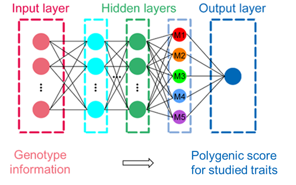
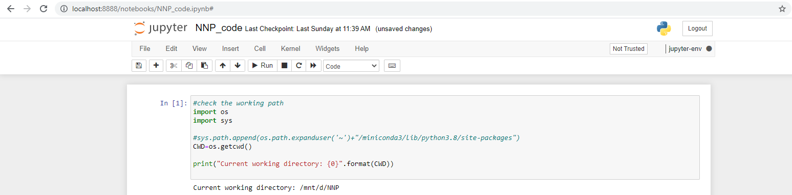
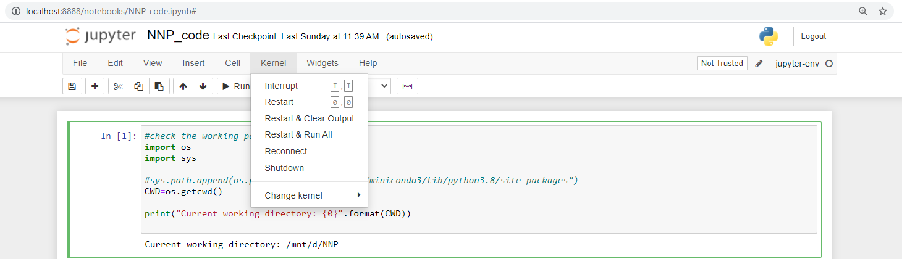

# NNP

# Content

- Introduction
- Installation
- Demo data
- Code
- How to cite

# Introduction

     This manual provides the guideline on how to implement the neural network model to the genotype data for polygenic risk analysis.

     NNP stands for "***Neural Network for Polygenic score analysis***".

     NNP uses the neural network model to summarize the effect of individual genetic variants onto a specific trait. This can simultaneously estimate the effect of variants, summarize their effects and finally calculate a polygenic score that correlated with the studied trait. A simple illustration of the model structure is shown in Fig. 1.



Fig. 1. Schematic for NNP. 

     Considering the privacy and confidentiality of genetic information, in this manual, we used the genomic data from 1000 Genomes Phase 3 data with ethnic background (East Asian) as an outcome for testing of the model. Users may modify your data according to the demo data for usage.

# Installation

     This manual has been successfully tested on a Ubuntu 18.04.2 LTS system equipped with 32G RAM and 8 CPUs.

- Install the Conda environment at your /home directory

```bash
cd 
wget https://repo.anaconda.com/miniconda/Miniconda3-latest-Linux-x86_64.sh

bash Miniconda3-latest-Linux-x86_64.sh
```

- Create the Conda enviorment for the analysis (Python version 3.8.0)

```bash
conda create -n jupyter-env jupyter python=3.8.0 numpy scipy pandas \
matplotlib sympy cython keras tensorflow scikit-learn
```

# Demo data

     Considering the privacy and confidentiality of human genetic information, we generated a dummy dataset for the demo.

     The demo data comprise two datasets, one **training dataset**, and one **test dataset.**

     For the **training dataset** and **test dataset**, they stored a matrix with a dimension of $N_i ×(M+2)$. The $N_i$ denotes the number of samples, with $M$ denotes the number of variants used for the modeling. Besides the genotype information, there are the additional 2 columns: the sample ID (the first column), and the phenotype labels (the last column). 

     In the example, we use the ethnic background as a phenotype and design a classification problem, i.e., to classify people under East Asian ancestry using the genetic information.

     The sample data can be found in the zipped packages:

     For **training dataset**, the "**train.txt**" stores the genotype and phenotype information for 1252 individuals with 2861 variants obtained from the MHC region (chr6:32,650,000-32,750,000; hg19).

     For the **test dataset**, the "**test.txt**" stores the genotype and phenotype information for another 1252 individuals with the same variants obtained from the MHC region.

# Code

     The complete code of this part is in the jupyter notebook file "**NNP_code.ipynb**". A PDF includes both the code and the output.

Here is the guideline on how to execute the code using jupyter notebook:

- Move to the folder stored the sample data and jupyter notebook and activate the environment

```bash
# move to the folder and activate Conda enviorment
cd /PATH_STORE_SAMPLE_DATA

conda activate jupyter-env

# add Conda enviorment as the jupyter kernel
pip install --user ipykernel
python -m ipykernel install --user --name=jupyter-env

# launch the jupyter notebook
jupyter notebook
```

- Paste the URL to the browser and open the "**NNP_code.ipynb**".  The web page should look like this.



- Click "Kernel"→ "Change-kernel", select "jupyter-env". Then, you may start the testing.
    
    
    

     The code is self-explanatory. For this exercise, we finally obtained an AUC of 0.974 and 0.917 for classifying East Asian ethnicity in the training and test datasets, respectively. The run time is less than 5 min.

     The polygenic score for training and test datasets are in "**train_score.csv**" and "**test_score.csv**". The intermediate outputs from the second last layer can be found in "**train_2ndLast_score.csv**" and "**test_2ndLast_score.csv**".

# How to cite

     The code is under the GNU General Public License v3 (GPL-3). 

     Please cite the publication when you used the code for your research work. Thank you!
